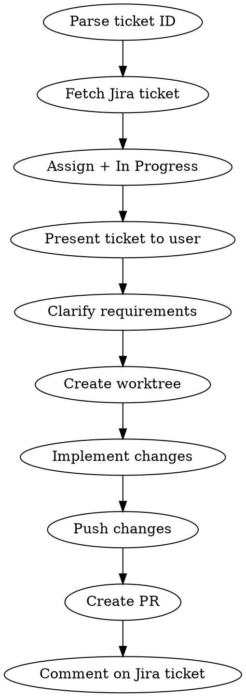

# Jira - End-to-End Ticket Implementation

## Overview

Orchestrates the full lifecycle of implementing a Jira ticket: fetch requirements, create isolated workspace, implement, push, create PR, and comment on the ticket.

**Core principle:** One command takes a ticket ID and drives the entire workflow from reading the ticket to posting results back.

## Arguments

**Ticket ID** (required): Jira ticket in PROJ-XXXX format (e.g. MYAPP-1234). Extract from user message.

## Workflow



### Step 1: Fetch Jira Ticket

```bash
bun skills/jira/jira-request.ts GET '/rest/api/2/issue/PROJ-XXXX'
```

Extract and present to user:
- **Summary** (title)
- **Description** (requirements)
- **Issue type** (Bug, Task, etc.)
- **Acceptance criteria** (if present)
- **Comments** (for additional context)

### Step 1b: Assign Ticket and Move to In Progress

**Assign to current user:**

```bash
bun skills/jira/jira-request.ts GET '/rest/api/2/myself'
```

Use the `accountId` from the response:

```bash
bun skills/jira/jira-request.ts PUT '/rest/api/2/issue/PROJ-XXXX' --body '{"fields":{"assignee":{"accountId":"ACCOUNT_ID"}}}'
```

**Move to In Progress** (skip if already In Progress):

First get available transitions:

```bash
bun skills/jira/jira-request.ts GET '/rest/api/2/issue/PROJ-XXXX/transitions'
```

Find the transition whose `to.name` is "In Progress", then:

```bash
bun skills/jira/jira-request.ts POST '/rest/api/2/issue/PROJ-XXXX/transitions' --body '{"transition":{"id":"TRANSITION_ID"}}'
```

### Step 1c: Clarify Requirements (if needed)

Review the ticket requirements for ambiguity. If any of these are true, stop and ask the user before continuing:
- Multiple valid interpretations of what's being asked
- Missing acceptance criteria on a non-trivial change
- Unclear which files/areas of the codebase are affected

If the requirements are clear, proceed directly.

### Step 2: Create Worktree

**REQUIRED:** Invoke the `using-git-worktrees` skill with the ticket ID (e.g., PROJ-1234). This creates an isolated branch and workspace.

### Step 3: Implement Changes

Based on the ticket requirements:
1. Plan the implementation
2. Write the code
3. Run tests to verify

### Step 4: Push Changes

Commit and push the branch.

### Step 5: Create PR

Create a PR targeting the appropriate base branch. Capture the PR URL.

### Step 6: Comment on Jira Ticket

Post a comment summarizing what was implemented and linking the PR:

```bash
bun skills/jira/jira-request.ts POST '/rest/api/2/issue/PROJ-XXXX/comment' --body '{
  "body": "Implementation complete.\n\n*Changes:*\n- Summary of what was done\n\n*Pull Request:*\nPR_URL_HERE"
}'
```

## Quick Reference

| Step | Tool | What Happens |
|------|------|-------------|
| Fetch ticket | `jira-request.ts GET` | Get requirements from Jira |
| Assign + transition | `jira-request.ts PUT/POST` | Assign to self, move to In Progress |
| Clarify requirements | Conversation | Ask if ambiguous |
| Create worktree | `using-git-worktrees` skill | Isolated branch + workspace |
| Implement | Write code + tests | Satisfy ticket requirements |
| Push | git commit + push | Push branch to remote |
| Create PR | `gh pr create` | PR targeting base branch |
| Comment | `jira-request.ts POST` | Link PR back to ticket |

## Common Mistakes

### Skipping the ticket fetch
- **Problem:** Implementing without understanding full requirements
- **Fix:** Always fetch and read the ticket first, present summary to user

### Not using worktree
- **Problem:** Working in dirty main workspace, branch conflicts
- **Fix:** Always create worktree via the skill for isolation

### Forgetting the Jira comment
- **Problem:** Ticket has no record of implementation or PR link
- **Fix:** Always post comment with changes summary and PR URL
